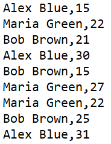

# Map-Interface
At the end of the elections it is necessary to obtain the total number of votes received by each candidate. For this, the Map interface was implemented where the key is the candidate's name and the value is the number of votes received. The data was extracted from the candidates.txt file, which has the number of votes received at different polling places, as represented below.

